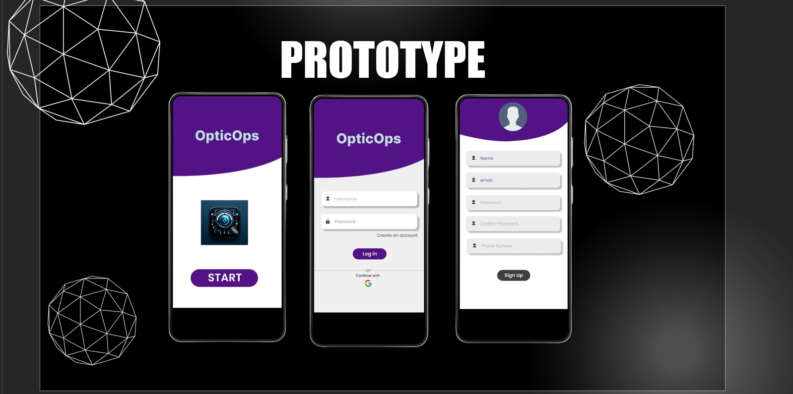
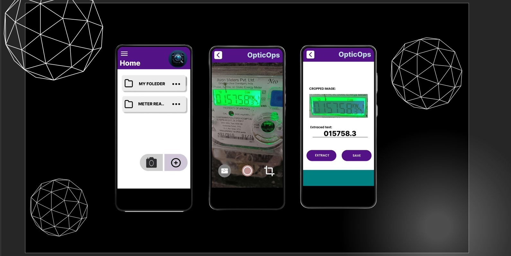

# OpticOps: Deep Learning-Based OCR for Automated Meter Reading

**OpticOps** is an end-to-end AI system designed to automate the extraction of digital meter readings (electricity, water, gas) from images using deep learning and OCR. The project combines a computer vision pipeline with a mobile-first prototype to streamline data collection, improve accuracy, and reduce human effort in utility metering.

---

## Why OpticOps?

Manual meter reading is still the standard in many regions, which introduces delays, errors, and high operational costs. OpticOps addresses these challenges by enabling:

- Image-based meter reading via mobile devices
- Automatic character recognition using deep learning
- Real-time, structured data extraction
- Easy integration with smart monitoring systems

---

## How It Works

Image Capture → Preprocessing → Character Recognition → Text Output

yaml
Copy code

1. **Capture**: Users take photos of digital/analog meter displays using a smartphone.
2. **Preprocessing**: Images are resized, denoised, and enhanced for better accuracy.
3. **Recognition**: A PyTorch-based model detects and classifies characters in sequence.
4. **Output**: Cleaned and validated text is generated and stored.

---

## Mobile App Prototype

The mobile UI allows users to log in, scan meter displays, extract readings, and save or send the results. Below are key interface screens and output samples.

<div align="center">
  
  <br/><br/>
  
</div>

---

## Tech Stack

- **Python** (Backend Model)
- **PyTorch** (Model training & inference)
- **Albumentations** (Image preprocessing)
- **scikit-learn** (Data processing & metrics)
- **Mobile UI** (Prototype in Figma/Flutter)

---

## Folder Structure

OpticOps/
├── config.py # Model configuration
├── dataset.py # Data preprocessing and loaders
├── engine.py # Training & evaluation loop
├── model.py # OCR model architecture (LcdModel)
├── train.py # Entry script to train the model
├── input/ # Training input images
├── models/ # Saved model weights
├── assets/ # App screenshots (used in README)
└── README.md

yaml
Copy code

---

## How to Run Locally

1. **Install dependencies**
   ```bash
   pip install torch torchvision albumentations scikit-learn
Prepare data

Add .jpg images to the input/ folder

Create a CSV label file in format: filename,label

Update config.py to match file paths and hyperparameters

Train the model

bash
Copy code
python train.py
Check output

Trained models saved in models/

Best checkpoint: lcd_model_best.pth

Project Status

-Model training and prediction pipeline complete
-App prototype designed and ready for development
-Deployment-ready format with modular Python code
-Prepared for integration with mobile or web interfaces

Conclusion

-OpticOps is a scalable and robust solution for automating meter reading using AI. It brings together the efficiency of deep learning and the convenience of mobile interfaces, helping reduce human errors and enable faster, more reliable data collection.
